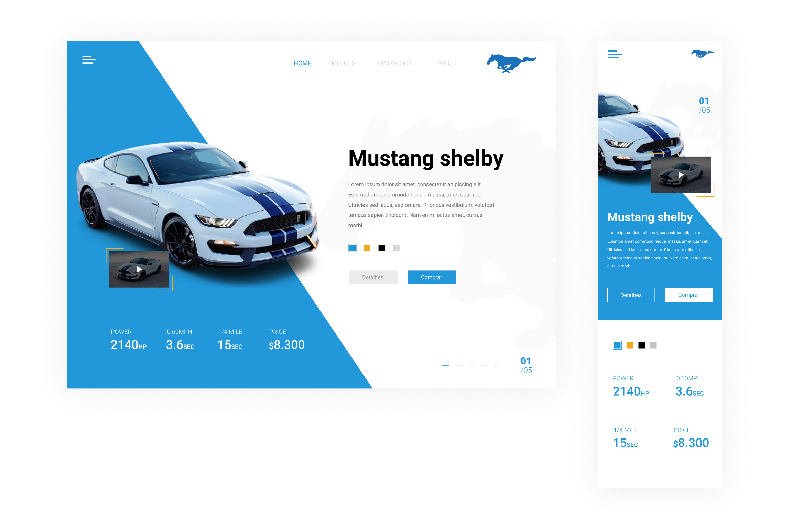

 

    

  <h3 align="center">Dealership</h3>
  
  

     Landing page de uma concessionária
        
     
    Desafio
    ·
    <a href="https://devchallenge.com.br/">DevChallenge</a>
  

## Índice

- [Devchallenge](#devchallenge)
- [Desafio](#desafio)
- [Tecnologias](#techs)
- [Como começar](#como-começar)
- [Guia de estilos](#styleguide)
- [Compartilhe](#compartilhe)

# Devchallenge

<a href="https://devchallenge.com.br/"> DevChallenge</a> é o lugar perfeito pra você praticar através de projetos

# Desafio

O seu desafio será construir a landing page de uma concessionária o mais fiel possível ao modelo disponível na pasta ´design´ desse repositório. 

## Indo além

Pode ficar a vontade para ir além se quiser, se divirta adicionando animações e mais dinamismo e vida á landing page!!!

# Techs:

- HTML
- CSS

# Como começar

- 1º - Faça um fork deste repositório e depois clone o repositorio que estará disponível na sua conta do github.
- 1º - Leia as instruções no Readme.md
- 3º - Agora manda ver, começe a codar!!
- 4º - Quando finalizar, fique a vontade para compartilhar com a comunidade!

# Guia de estilos

Dentro da pasta design você vai encontrar um arquivo chamado style-guide.md contendo informações sobre as cores, fontes, breakpoints e etc.

# Assets

Os arquivos, como imagens e icones você vai encontrar na pasta ./assets

# Compartilhe!

Tire um print, faça um gif ou vídeo para compartilhar o resultado com a #devchallenge ou marcando nosso perfil @devchallenge! 

Design criado por <a href="www.linkedin.com/in/danilolma">Danilo Lima</a>

# Comunidade DevChallenge

- <a href="https://devchallenge.com.br/">DevChallenge</a>
- <a href="https://discord.gg/yvYXhGj">Discord</a>
- <a href="https://www.linkedin.com/company/devchallenge/">Linkedin</a>
- <a href="https://twitter.com/dev_challenge">Twitter</a>
- <a href="https://www.instagram.com/devchallenge/">Instagram</a>
